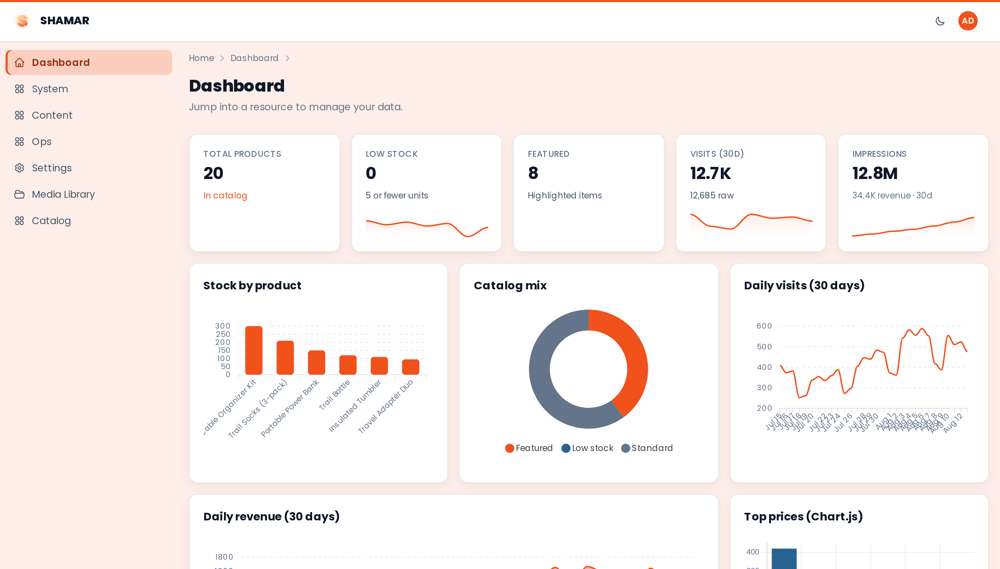

<p align="center">
  <a href="https://shamar.dev">
    
  </a>
</p>

<h1 align="center">Shamar</h1>

<p align="center">
  <strong>Filament-inspired admin panels for AdonisJS</strong><br />
  Declarative resources · Lucid or Mongoose · Wire · RBAC · REST
</p>

<p align="center">
  <a href="https://shamar.dev"><strong>Docs</strong></a>
  ·
  <a href="https://demo.shamar.dev"><strong>Live demo</strong></a>
  ·
  <a href="https://www.npmjs.com/package/@shamar/adonis"><strong>npm</strong></a>
</p>

<p align="center">
  <a href="https://github.com/coolsam726/shamar/actions/workflows/ci.yml"></a>
  <a href="https://www.npmjs.com/package/@shamar/core"></a>
  <a href="https://www.npmjs.com/package/@shamar/core"></a>
  <a href="https://github.com/coolsam726/shamar/stargazers"></a>
  <a href="LICENSE"></a>
</p>

Inspired by [Filament](https://filamentphp.com/) and [Almasix Orbit](https://github.com/almasix-dev/almasix-orbit) — built natively for AdonisJS.

## Install

```bash
pnpm add @shamar/adonis
# plus one ORM:
pnpm add @adonisjs/lucid   # SQL
# or
pnpm add mongoose          # MongoDB

node ace configure @shamar/adonis
```

Define resources under `app/panels/…`, then open the panel (default `/admin`).

## Quick start

```ts
// app/panels/admin/resources/user_resource.ts
import {
  Resource,
  TextInput,
  TextColumn,
  Toggle,
  type FormBuilder,
  type TableBuilder,
} from '@shamar/core'
import User from '#models/user'

export default class UserResource extends Resource {
  static model = User
  static slug = 'users'
  static label = 'Users'

  static form(form: FormBuilder) {
    return form.schema([
      TextInput.make('name').required(),
      TextInput.make('email').email().required().searchable(),
      TextInput.make('password').password().createOnly(),
      Toggle.make('active'),
    ])
  }

  static table(table: TableBuilder) {
    return table.schema([
      TextColumn.make('name').sortable(),
      TextColumn.make('email').sortable().searchable(),
      TextColumn.make('active').toggle(),
    ])
  }
}
```

```ts
// app/panels/admin/panel.ts
import { PanelProvider, panel } from '@shamar/adonis'

export default class AdminPanel extends PanelProvider {
  panel() {
    return panel('admin')
      .path('/admin')
      .discoverResources('app/panels/admin/resources')
      .discoverPages('app/panels/admin/pages')
      .branding({ name: 'Admin' })
  }
}
```

## Packages

| Package | Role |
|---------|------|
| [`@shamar/core`](packages/core) | Resource DSL — forms, tables, actions, schemas |
| [`@shamar/adonis`](packages/adonis) | Host — providers, routes, Edge UI |
| [`@shamar/wire`](packages/wire) | Server-driven islands (`wire:*`, `$wire`) |
| [`@shamar/lucid`](packages/lucid) / [`@shamar/mongoose`](packages/mongoose) | SQL / Mongo adapters |
| [`@shamar/cherubim`](packages/cherubim) | Auth, abilities, API keys |
| [`@shamar/rest`](packages/rest) | JSON API + OpenAPI / Scalar |

## Development

```bash
pnpm install
pnpm docker:up    # MongoDB
pnpm build
pnpm test
pnpm docker:dev   # playground HMR on :3333
```

Local demo app: [`apps/playground`](apps/playground). Deploy notes: [`DEPLOY.md`](DEPLOY.md).

## License

[MIT](LICENSE)
